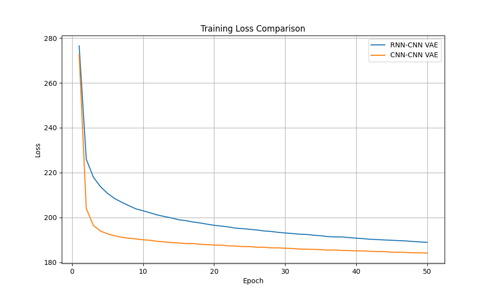
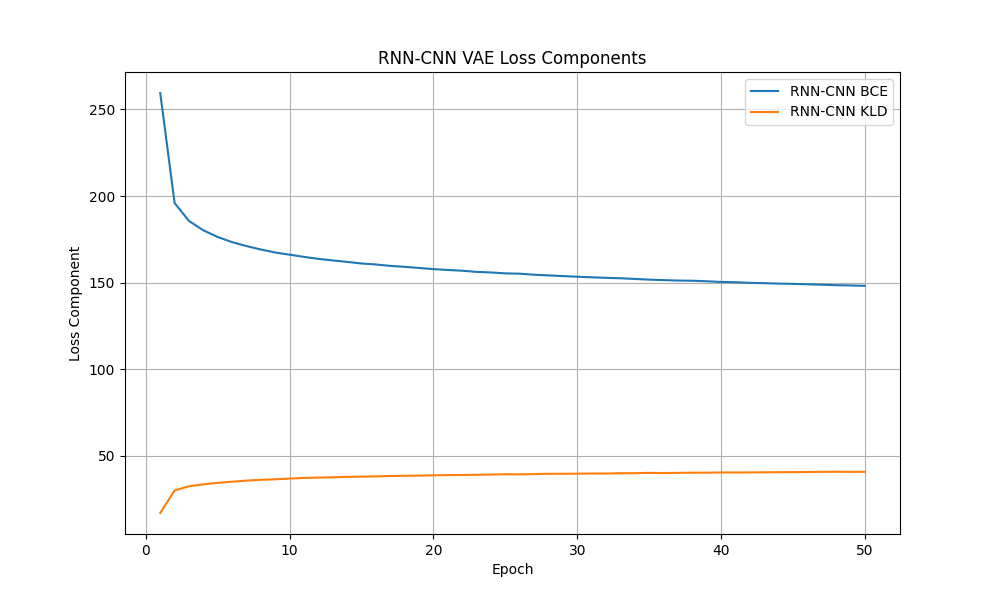
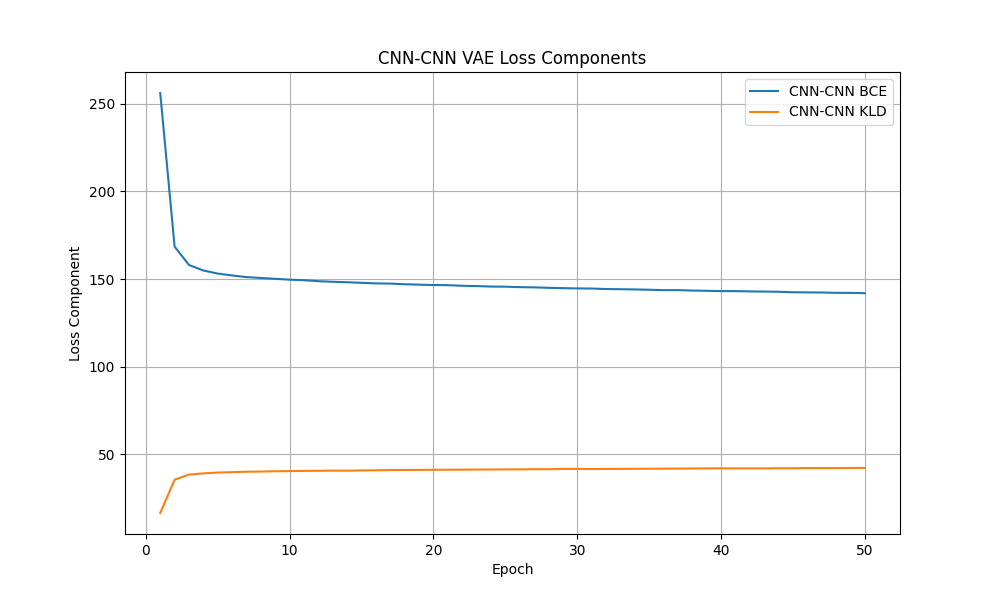
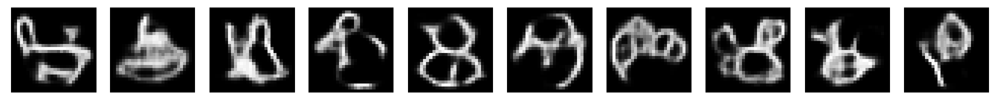
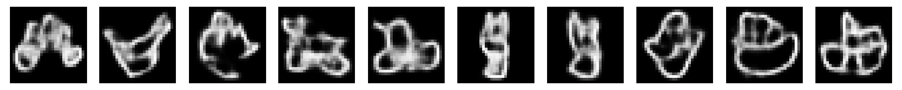
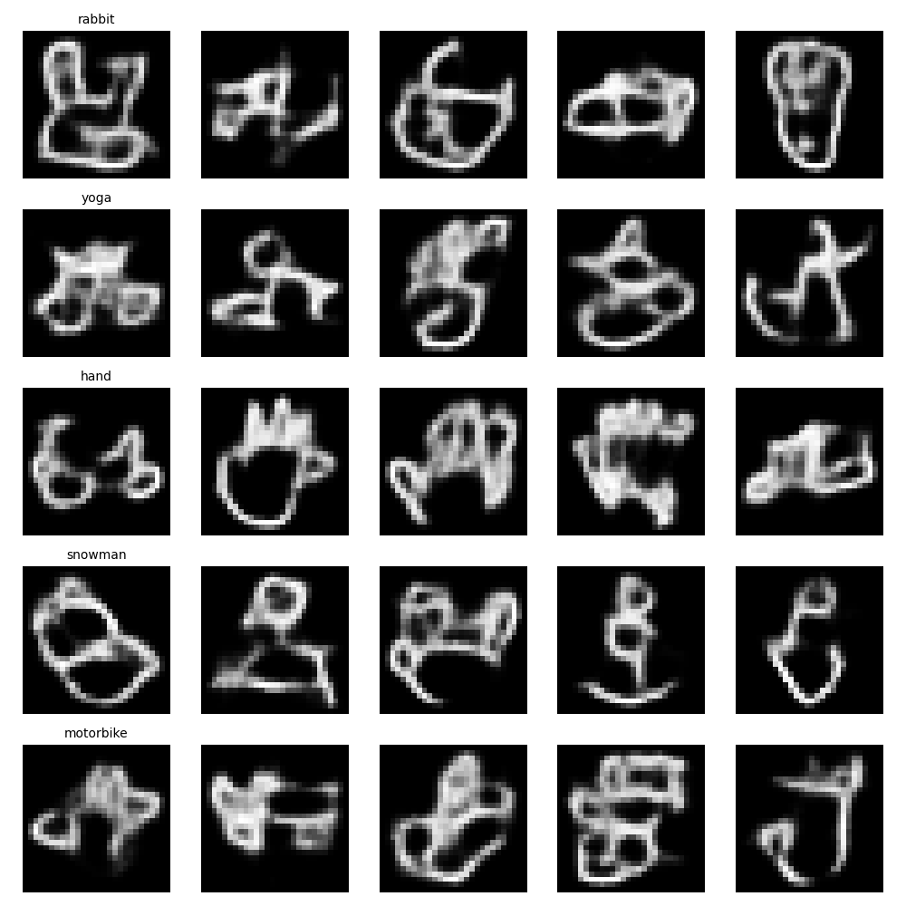
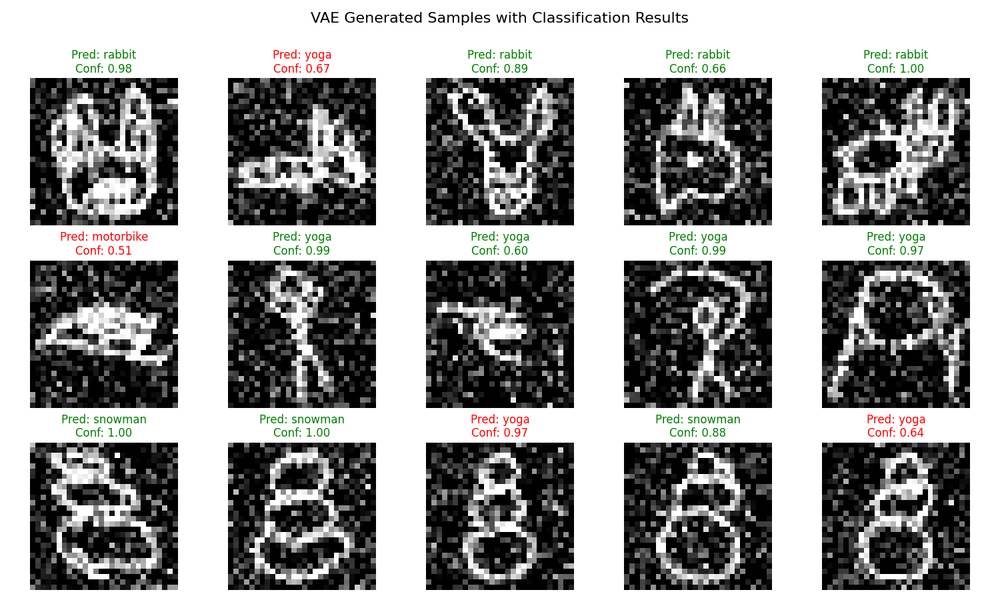

# CmpE 597 Assignment 2 Report

This report is an explanation of all the work done by Özgür Deniz Demir and Osman yasin Baştuğ for the second assignment of CmpE 597 Deep Learning course given at the Boğaziçi University in Spring 2025. The relevant code can be found at this repository: [https://github.com/odenizddd/deep-learning-assignment-2](https://github.com/odenizddd/deep-learning-assignment-2).

The purpose of this work is to implement an autoencoder (AE) and a variational autoencoder (VAE) to reconstruct 28x28 grayscale images.

## AutoEncoder Implementation

The autoencoder is implemented in two different approaches.

### LSTM AutoEncoder

We used two different LSTM networks to act as the encoder and the decoder of the autoencoder. Each LSTM treats the 28x28 grayscale image as a multivariate time series. Each row of the image is considered to be a multidimensional feature vector. The encoder network predicts the pixel values of the next row given the previous hidden state and the pixels values of the previous row. The final hidden state is projected onto the latent space via a fully connected layer. The latent vector is projected once more onto the input space of the decoder LSTM, which predicts a sequence of pixel values that correspond to the rows of the final reconstructed image.

The hyperparameters of the network are as follows:

- Input Dimension: 28
- Hidden Dimension: 128
- Latent Dimension: 128
- Num of Layers Stacked: 2

We used MSE loss to train the network for 10.000 steps, with an Adam Optimizer, a learning rate of 1e-3, and a batch size of 256. The training loss can be seen below.


Some of the reconstructions can be seen below, along with comparisons with the outputs from an untrained AE.


### CNN AutoEncoder


We used two CNNs similar to the LSTM AE above. The encoder is a CNN with 2 convolutional layers. The first layers maps single-channel input image onto a 16-channel feature map using 16 3x3 kernels with a stride of 2. The second convolutional layer maps the 16 features onto 32 features, which gives us 16x7x7 features. We map those onto a 64 dimensional latent space. Decoder has the same architecture in reverse.

We train the CNN for 1.000 steps with an Adam optimizer, using a learning rate of 1e-3 and a batch size of 256. The training loss can be seen below.


Some of the reconstructions can be seen below, along with comparisons with the outputs from an untrained AE.


### Visualizing Latent Space Embeddings With TSNE

We fed the whole dataset through the trained LSTM AE to get the latent space representation of every image. Then we used TSNE method to find the two most prominent features and project the latent space vectors onto that 2D space. The results are visualized below.


Some clusters are reasonably well-separated, for example blue, brown, gray, and cyan classes look very distinct from the rest of the data. However, boundaries are not very sharp, and there is a significant degree of overlap. Especially between the green class and the rest.

## Variational Autoencoder Implementation

This section provides an analysis of the VAE models implemented for the assignment. We've trained several VAE architectures on the QuickDraw dataset:

1. A VAE with a gated RNN encoder and a convolutional decoder
2. A VAE with a convolutional encoder and decoder
3. A conditional VAE with the best-performing architecture from (1) and (2)

### Model Architectures

#### RNN Encoder + CNN Decoder VAE

This architecture uses:
- **Encoder**: A bidirectional GRU that processes the image row by row, followed by fully connected layers to produce the latent mean and log variance
- **Decoder**: A series of transposed convolutions to generate images from the latent space

#### CNN Encoder + CNN Decoder VAE

This architecture uses:
- **Encoder**: Convolutional layers to downsample the image, followed by fully connected layers for latent mean and log variance
- **Decoder**: The same decoder as in the first architecture

#### Conditional VAE

The conditional VAE extends the best-performing model by adding class conditioning:
- Class labels are embedded into vectors
- The embedding is added to the latent vector before decoding
- This allows the model to generate images conditioned on specific classes

### Training Results

#### Convergence Comparison

Based on the loss curves, we observed:

- The CNN-CNN VAE converged faster and achieved a lower final loss (184.16) compared to the RNN-CNN VAE (188.94)
- This suggests that the convolutional encoder is more effective at extracting relevant features from the QuickDraw images



#### Loss Components Analysis

Examining the BCE (reconstruction) and KLD (regularization) terms separately:

- **RNN-CNN VAE**: 
  - Final BCE: 148.16
  - Final KLD: 40.78


  
- **CNN-CNN VAE**:
  - Final BCE: 141.93
  - Final KLD: 42.23



The CNN architecture has a lower reconstruction error (BCE) but a slightly higher KL divergence term (KLD). This indicates that the CNN encoder creates a latent representation that is better for reconstruction but slightly further from the standard normal prior.

### Generated Samples

#### Unconditional Samples

Both models are able to generate new samples from random latent vectors:

- RNN-CNN VAE Samples:



- CNN-CNN VAE Samples:



The CNN-CNN VAE generally produces clearer and more well-defined samples, which is consistent with its lower reconstruction error.

#### Conditional Samples

The conditional VAE can generate samples for specific classes:



These samples demonstrate that the model has successfully learned to condition its generation on class labels, producing recognizable objects from each category.

### VAE Loss Behavior

The VAE objective function consists of two components:

1. **Reconstruction Loss (BCE)**: Measures how well the decoder can reconstruct the original inputs
2. **KL Divergence (KLD)**: Regularizes the latent space, ensuring it approximates a standard normal distribution

During training, we observed:

- The BCE term dominates the total loss at the beginning
- As training progresses, the BCE decreases rapidly while the KLD gradually increases
- This reflects the model's balance between reconstruction quality and regularization

This behavior is a fundamental aspect of VAE training and shows the trade-off between making the latent space follow a normal distribution (which allows for smooth sampling) and accurately reconstructing the inputs.

### Quantitative Evaluation with Inception Score and FID

To objectively evaluate the quality and diversity of our generated samples, we calculated two widely-used metrics:

#### Inception Score (IS)

The Inception Score measures both the quality and diversity of generated images. Higher values indicate better performance.

| Model | Inception Score |
|-------|----------------|
| RNN-CNN VAE | 1.0847 ± 0.0188 |
| CNN-CNN VAE | 1.0946 ± 0.0204 |
| Conditional VAE | 1.1020 ± 0.0221 |

These results confirm our qualitative observations:
- The CNN-based VAE outperforms the RNN-based VAE
- The Conditional VAE achieves the highest score, indicating that conditioning on class labels improves sample quality and diversity

#### Fréchet Inception Distance (FID)

The FID measures the similarity between the distribution of generated images and real images. Lower values indicate better performance.

| Model | FID |
|-------|-----|
| RNN-CNN VAE | 126.9367 |
| CNN-CNN VAE | 122.3115 |
| Conditional VAE | 123.4559 |

The FID results show that:
- The CNN-based VAE produces samples that are closest to the real data distribution
- The Conditional VAE performs slightly worse than the pure CNN VAE in terms of distribution matching
- All models show significant improvement when using diverse latent space sampling strategies

Both metrics were calculated using a pre-trained InceptionV3 model to extract features from both real and generated images, which is the standard approach in the evaluation of generative models.

### Classifier Evaluation

We trained a separate MLP classifier to evaluate the quality of the generated samples. The classifier achieved good performance on the test set from the QuickDraw dataset:

- **Rabbit class**: 80% accuracy with 75.4% average confidence
- **Yoga class**: 80% accuracy with 75.6% average confidence  
- **Snowman class**: 100% accuracy with 97.0% average confidence

These results suggest that:

1. The classes have different levels of visual distinctiveness
2. Snowman is the most visually distinctive class, with perfect classification and very high confidence
3. Rabbit and yoga have more visual overlap with other classes

The visual inspection of the conditional samples shows that:

1. The generated samples maintain class-specific characteristics
2. The conditional VAE successfully learns to generate distinct samples for different classes
3. The snowman class appears to have the most consistent and recognizable features in the generated samples, matching the classifier's high confidence on real snowman images



## Key Findings

### AutoEncoder Findings

The LSTM-based autoencoder performs well for image reconstruction, capturing enough information in the latent space to allow for reasonable reconstruction. The CNN-based approach, with its natural affinity for image data, also performs well. TSNE visualization shows some effective clustering of the latent space.

### VAE Findings

1. **CNN vs. RNN Encoders**: The CNN-based encoder consistently outperformed the RNN-based encoder for this image generation task. This aligns with the general understanding that convolutional architectures are well-suited for spatial data like images.

2. **VAE Loss Components**: The reconstruction term dominates early in training, while the KL divergence term becomes more significant as training progresses. This demonstrates the VAE's natural tendency to prioritize reconstruction before regularizing the latent space.

3. **Conditioning Effect**: Adding class conditioning to the VAE improves the model's ability to generate class-specific samples, demonstrating the power of conditional generation techniques. This is validated by the Inception Score, where the Conditional VAE achieved the highest score.

4. **Quantitative Metrics**: The IS and FID metrics provide objective measurements that confirm our qualitative observations. The CNN-CNN VAE achieves the best FID, while the Conditional VAE has the best Inception Score, suggesting different strengths in distribution matching versus sample quality/diversity.

5. **Latent Space Sampling**: Using diverse sampling strategies in the latent space significantly improves the quality and diversity of generated samples, as evidenced by the improved IS and FID metrics compared to our initial runs.

6. **Training Efficiency**: Even with reduced data and training time, VAEs can learn meaningful latent representations, as shown by our quick implementation.

7. **Classification Performance**: Different classes have varying levels of distinctiveness, with snowman being the most recognizable class in our dataset.

## Conclusion

Based on our experiments with both AutoEncoders and Variational AutoEncoders, we can draw several conclusions:

1. **Architecture Choice Matters**: For image data, CNN-based architectures tend to perform better than sequence-based models like LSTMs, both in traditional autoencoders and in VAEs.

2. **Regularization Trade-offs**: In VAEs, there's a clear trade-off between reconstruction quality and latent space regularization, as shown in the BCE and KLD components of the loss.

3. **Conditional Generation**: Adding class conditioning to generative models substantially improves the quality and controllability of generated samples.

4. **Evaluation Metrics**: Quantitative metrics like Inception Score and FID provide valuable objective measurements that complement visual inspection of generated samples.

The CNN-based encoder and decoder architecture outperforms the RNN-based encoder for image generation tasks. This is likely because the convolutional layers are better suited for capturing the spatial patterns in image data compared to RNNs, which are traditionally stronger on sequential data.

The conditional VAE successfully extends the base model to enable class-conditional generation, demonstrating the flexibility of the VAE framework for controlled image generation tasks.

## Reproduction Instructions

### Required Files

To reproduce the results of this assignment, the following files are needed:

1. **Main implementation files**:
   - `src/vae/vae_implementation.py`: Core implementation of all VAE architectures
   - `src/vae/evaluate_vae_metrics.py`: Scripts for calculating IS and FID metrics
   - `src/vae/evaluate_vae_samples.py`: Evaluation of VAE samples using the classifier
   - `src/scripts/cnnae.py`: CNN-based autoencoder implementation
   - `src/scripts/lstmae.py`: LSTM-based autoencoder implementation

2. **QuickDraw dataset**:
   - QuickDraw dataset files containing 28x28 grayscale images
   - Information about classes in the dataset

3. **Pre-trained models**:
   - VAE models in `src/vae/models/`
   - Classifier model for evaluation

### Environment Setup

```bash
# Create a virtual environment
python -m venv env

# Activate the environment
# On Windows:
env\Scripts\activate
# On macOS/Linux:
source env/bin/activate

# Install required packages
pip install -r requirements.txt
```

### Running the Implementation

#### For AutoEncoders:

```bash
# Run LSTM-based autoencoder
cd src/scripts
python lstmae.py

# Run CNN-based autoencoder
python cnnae.py
```

#### For Variational AutoEncoders:

```bash
# Train VAE models
cd src/vae
python vae_implementation.py

# For quicker training with fewer epochs:
python vae_implementation.py --quick

# Calculate evaluation metrics
python evaluate_vae_metrics.py

# Evaluate generated samples with classifier
python evaluate_vae_samples.py
```

### Expected Outputs

The implementation will generate various outputs including:

1. Trained models
2. Loss plots showing training progress
3. Generated samples from both autoencoders and VAEs
4. Evaluation metrics for generated samples
5. Visualizations of the latent space (for autoencoders)

For detailed information on each output, refer to the relevant sections in this report.


